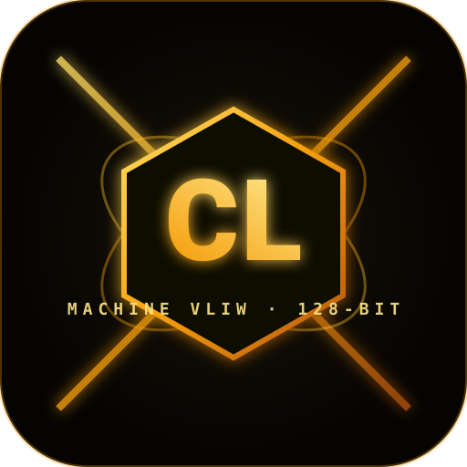
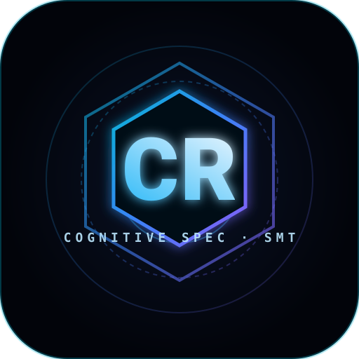

# CRON Programming Language Ecosystem
**Next-Generation Cognitive Architecture Language for 256-Core 4D-Torus Neuromorphic Hardware**

```
  ██████╗██████╗  ██████╗ ███╗   ██╗
 ██╔════╝██╔══██╗██╔═══██╗████╗  ██║
 ██║     ██████╔╝██║   ██║██╔██╗ ██║
 ██║     ██╔══██╗██║   ██║██║╚██╗██║
 ╚██████╗██║  ██║╚██████╔╝██║ ╚████║
  ╚═════╝╚═╝  ╚═╝ ╚═════╝ ╚═╝  ╚═══╝
```

---

## 1. Тойм ба Архитектур (Overview)

CRON бол уламжлалт von Neumann архитектур (CPU/GPU, санах ойн түгжрэл, өндөр дулаан ялгаруулалт)-ын хязгаарлалтыг даван туулах зорилгоор бүтээгдсэн, **Hardware-Software Co-Design** зарчимтай цоо шинэ програмчлалын хэл юм.

### Хоёр Ихэр Хэлний Загвар (Dual-Language Architecture):

<div align="center">

| **.cl (Cognitive Low-level)** | **.cr (Cognitive Representation)** |
|:---:|:---:|
|  |  |
| **Machine-Native VLIW** | **Human-Facing Cognitive Blueprint** |
| `Electric Neon Gold / Amber` | `Holographic Cyan / Violet` |
| 128-бит VLIW, 10 тэмдэгттэй үүрүүд | Шугаман төрөл (`lin`), Бүсийн Арена |
| [docs/cl_language_spec.md](docs/cl_language_spec.md) | [docs/cron_spec.md](docs/cron_spec.md) |

</div>

1. **`.cl` (Machine-Native VLIW / AI Co-Pilot Format)**:
   - 1 такт = 4 зааврын үүр (Slot 0, 1, 2, 3) бүхий 128 битийн VLIW багц.
   - Үүр бүр 10 тэмдэгттэй хатуу бүтэцтэй, 8 дахь тэмдэгт нь Parity хамгаалалттай.
   - 256 цөмт 4D-Torus чипийн RTL удирдлагын утсуудтай 1:1 шууд бууна.
2. **`.cr` (CRON High-Level Blueprint / Human Interface)**:
   - Python/Rust-ийн хослол шиг тунгалаг, цэвэрхэн бүтэц.
   - **Linear Types (`let lin ...`)**: Санах ойн цоорхой (memory leak)-г компиляторын түвшинд 100% хаана.
   - **Scoped Arena Regions (`region { ... }`)**: Гарахад 0-тактад санах ойг цэвэрлэнэ (0 Garbage Collection).
   - **6 Тархины примитивүүд**: Фотоник MZI, буцах логик, STDP синапс, учир шалтгааны бэлгэдэл дүрэм.

---

## 2. 6 Тархины Төрөлх Примитивүүд (The 6-Brain Primitives)

| Тархи | Нэршил | .cr Примитивүүд | Техник хангамжийн нэгж | .cl Заавар |
|---|---|---|---|---|
| **Brain 1** | Symbolic & Causal Graph | `ground_and_unify()`, `ground_to_symbol()` | Causal Graph Accelerator | `_UN`, `_SY` |
| **Brain 2** | Photonic Latent Engine | `optical_gemm(wave=...)`, `pack_wave()` | MZI Photonic Mesh | `_OP`, `_FA` |
| **Brain 3** | Reversible Memory | `backward()`, `reversible_entangle()` | Fredkin/Toffoli Reversible ALU | `_BK`, `_RF` |
| **Brain 4** | Neuromorphic STDP | `step_synaptic_plasticity()`, `subbyte_dot()` | STDP Plasticity Array | `_ST`, `_GU` |
| **Brain 5** | Superposition Planner | `quantum_collapse_eval()` | Decision Superposition Tree | `_QP`, `_CO` |
| **Brain 6** | Metacognitive Sentry | `resilient_compute`, `assert_homotopy` | Thermal Sentry Watchdog Fiber | `_SH`, `_PTC` |

---

## 3. Төслийн Бүтэц (Directory Structure)

```
new code language/
├── Cargo.toml                       # Root Rust Workspace
├── docs/
│   ├── cron_spec.md                 # CRON хэлний албан ёсны дүрэм, EBNF грамматик
│   └── isa_spec.md                  # 4D-Torus ба .cl VLIW зааврын архитектур
├── examples/
│   ├── unified_six_brain_agi.cr     # 6 Тархи бүхий жинхэнэ CRON код
│   ├── unified_six_brain_agi.cl     # Хөрвүүлэгдсэн VLIW машины код
│   └── unified_six_brain_agi_roundtrip.cr # Декомпилятороор буцааж гаргасан код
└── crates/
    ├── cronc/                       # CRON Compiler (Lexer, Parser, Checker, Codegen)
    ├── cron-vm/                     # 256-Core 4D-Torus Cycle-Accurate Simulator
    ├── cron-decompile/              # Machine-to-Blueprint Reverse Decompiler (.cl -> .cr)
    └── cron-cli/                    # Нэгдсэн CLI хэрэгсэл (`cron`)
```

---

## 4. Хэрэглэх Заавар (CLI Usage)

```bash
# 1. Синтакс болон Linear type алдааг шалгах
cargo run --bin cron -- check examples/unified_six_brain_agi.cr

# 2. .cr эх кодыг .cl VLIW машины код руу хөрвүүлэх (Compile)
cargo run --bin cron -- build examples/unified_six_brain_agi.cr -o output.cl

# 3. 256-цөмт 4D-Torus Симулятор дээр бүтэн ажиллуулах (Run & Telemetry)
cargo run --bin cron -- run examples/unified_six_brain_agi.cr

# 4. .cl машины кодыг буцаан .cr хэл рүү хөрвүүлэх (Decompile)
cargo run --bin cron -- decompile output.cl -o decompiled.cr

# 5. Бодит AI загвар (ONNX / SafeTensors) татан авч Sub-byte / BitNet 1.58b болгон буулгах (Import)
cargo run --bin cron -- import examples/sample_transformer.onnx -o imported.cr --quantize ternary --compile cl

# 6. Төсөлд шинэ хараат сан нэмэх (cron add) ба багц мод харах (cron pkg tree)
cargo run --bin cron -- add cron/distributed
cargo run --bin cron -- pkg tree
cargo run --bin cron -- install

# 7. Физик FPGA/ASIC төхөөрөмж рүү байршуулах ба PCIe DMA үүсгэх (Flash)
cargo run --bin cron -- flash examples/cl/mini_transformer_attention.cl --target xilinx_u280 --out-dir ./deploy

# 8. Албан ёсны DOR Deadlock-Freedom ба Ландауэр термодинамик шалгалт (Verify)
cargo run --bin cron -- verify examples/cl/mini_transformer_attention.cl --temp 300.0 --freq 1.0

# 9. Бие даасан .cl Машин Хэлний JIT Ажиллуулагч (0-диск I/O, микросекунд)
cargo run --bin cron -- cl-run examples/cl/mini_transformer_attention.cl

# 10. AI Vibe-Coding Өөрийгөө Эдгээгч ба CRC-8 Засагч (Heal)
cargo run --bin cron -- cl-heal examples/cl/mini_transformer_attention.cl -o healed.cl

# 11. VLIW Слотыг нягтруулагч Супер-Оптимайзер (Compaction, IPC -> 4.0)
cargo run --bin cron -- cl-opt examples/cl/mini_transformer_attention.cl -o optimized.cl

# 12. .cl машинаас шууд SSA LLVM IR болон Verilog RTL синтезлэх
cargo run --bin cron -- cl-llvm examples/cl/mini_transformer_attention.cl -o kernel.ll
cargo run --bin cron -- cl-verilog examples/cl/mini_transformer_attention.cl -o core.v

# 13. Интерактив .cl Live Vibe-Coding REPL Силикон Консол
cargo run --bin cron -- cl-repl

# 14. 256-Цөмт 4D-Torus Орон зайн Linker (NoC чиглүүлэлт, PGAS, C23 ба Verilog гаргах)
cargo run --bin cron -- cl-link examples/cl/multicore_4d_pipeline.cl -o pipeline.clpack --emit-c pipeline.c --emit-verilog pipeline.v

# 15. Hardware Co-Simulation Bridge (Lockstep Parity with Synthesizable Verilog RTL)
cargo run --bin cron -- cl-cosim examples/cl/mini_transformer_attention.cl --trace

# 16. DAG Critical-Path VLIW Super-Optimizer (Level 2 Out-of-Order Compaction)
cargo run --bin cron -- cl-opt examples/cl/mini_transformer_attention.cl --level 2

# 17. PGAS 16-Bank Conflict-Free Formal Verifier (GF(2^4) Galois Field XOR Swizzling)
cargo run --bin cron -- cl-memcheck examples/cl/mini_transformer_attention.cl

# 18. Автономит AI Vibe-Fuzz & Mutation Resilience Engine (Zero-Crash Invariant)
cargo run --bin cron -- cl-fuzz --iterations 500

# 19. Hardware Roofline Model & Operational Intensity Benchmark (FLOPs/Byte)
cargo run --bin cron -- cl-bench examples/cl/mini_transformer_attention.cl

# 20. Golden AI Silicon Micro-Kernel Синтезлэгч (FlashAttn, BitNet, RMSNorm, SwiGLU, RoPE, KV-Cache)
cargo run --bin cron -- cl-kernel list
cargo run --bin cron -- cl-kernel flash-attn -o flash_attn.cl

# 21. Standalone Эх Системийн Хост Компилятор (C23/C11 AOT -O3 Native Binary & Direct Execution)
cargo run --bin cron -- cl-native flash_attn.cl -o flash_attn.exe --run

# 22. Polyhedral VLIW Loop Tiler & Tensor Contraction (GEMM, Conv2D, 16-Bank Conflict-Free)
cargo run --bin cron -- cl-tile gemm --m 128 --n 128 --k 128 -o tiled_gemm.cl
cargo run --bin cron -- cl-tile conv --cin 32 --cout 64 --spatial 16 --json

# 23. Multi-Die 5D Hierarchical Mesh & Collective Communication Protocol (AllReduce, AllGather)
cargo run --bin cron -- cl-cluster topology --chips 4
cargo run --bin cron -- cl-cluster collective allreduce --chips 4 --bytes 1024 -o allreduce.cl
cargo run --bin cron -- cl-cluster c23 allreduce.cl --chips 4 -o cluster_sim.c

# 24. 2:4 Бүтцийн Сийрэгжилт (Structural Sparsity) ба Zero-MAC Pruning (2x хурдатгал)
cargo run --bin cron -- cl-sparse kernel --m 128 --n 128 --k 128 -o sparse_gemm.cl
cargo run --bin cron -- cl-sparse analyze dummy.dat --json

# 25. Landauer Термодинамик DVFS & Силикон Дулааны Симуляци (ΔS = 0 Fredkin / MZI)
cargo run --bin cron -- cl-power examples/cl/mini_transformer_attention.cl --freq 2.0 --temp 300.0
cargo run --bin cron -- cl-power examples/cl/mini_transformer_attention.cl --json

# 26. Spec-to-Silicon Олон Зорилтот Авто-Тохируулагч (Pareto Frontier, DVFS, Слот нягтруулалт)
cargo run --bin cron -- cl-autotune --m 64 --n 64 --k 64 --metric balanced -o tuned_gemm.cl
cargo run --bin cron -- cl-autotune --m 32 --n 32 --k 32 --json

# 27. Zero-Copy Олон Хэлбэрт (Multi-Modal) Орон Зайн Урсгал Хөдөлгүүр (Аудио, Видео, Сенсор)
cargo run --bin cron -- cl-stream vision --dim 224 --patch 16 -o vision_pipe.cl
cargo run --bin cron -- cl-stream audio --bands 80 --quant 4 --json

# 28. Brain 4 Нейроморф SNN & STDP Пластик Хөдөлгүүр (LIF Нейрон, Растер график, Sub-Byte Crossbar)
cargo run --bin cron -- cl-snn synth --neurons 16 -o snn_kernel.cl
cargo run --bin cron -- cl-snn sim --neurons 16 --cycles 30
cargo run --bin cron -- cl-snn sim --neurons 8 --cycles 16 --json

# 29. Бүтэн Төгсгөлийн LLM Transformer Inference Хөдөлгүүр (BitNet 1.58b, SwiGLU, KV-Cache, RoPE)
cargo run --bin cron -- cl-infer prompt "CRON" --tokens 8 --dim 64 --layers 2
cargo run --bin cron -- cl-infer synth --dim 64 --layers 2 -o transformer_kernel.cl
cargo run --bin cron -- cl-infer prompt "AI" --dim 32 --tokens 4 --json

# 30. Language Server Protocol (LSP 3.17) Сервер (.cl болон .cr бодит цагийн алдаа, Hover, QuickFix)
cargo run --bin cron -- lsp --version
cargo run --bin cron -- lsp

# 31. CORDIC & Комплекс Геометр Хөдөлгүүр (Brain 2 Фотоник MZI Фаз, Brain 5 Квант Блох Сфер, RoPE)
cargo run --bin cron -- cl-cordic rot --angle 0.785398 --iters 16 --orbit
cargo run --bin cron -- cl-cordic vec --x 3.0 --y 4.0 --iters 16
cargo run --bin cron -- cl-cordic sphere --theta 1.047 --phi 0.785
cargo run --bin cron -- cl-cordic synth --iters 16 -o cordic.cl
cargo run --bin cron -- cl-cordic rot --angle 0.785398 --json

# 32. Циклийн Нарийвчлалтай VCD & Дижитал Логик Анализатор (IEEE 1364-2001 VCD, GTKWave, ASCII Waveform)
cargo run --bin cron -- cl-vcd examples/cl/mini_transformer_attention.cl
cargo run --bin cron -- cl-vcd examples/cl/mini_transformer_attention.cl -o trace.vcd --cycles 32
cargo run --bin cron -- cl-vcd examples/cl/mini_transformer_attention.cl --json

# 33. Автономит Силикон Микро-Кернел PPA & Performance Свиит (Roofline, TOPS/W, EDP, Scoreboard)
cargo run --bin cron -- cl-perf examples/cl/mini_transformer_attention.cl
cargo run --bin cron -- cl-perf --all
cargo run --bin cron -- cl-perf --all --json
cargo run --bin cron -- cl-perf examples/cl/mini_transformer_attention.cl --freq 3.0 --cores 512

# 34. 4D-Torus Орон Зайн Ачаалал Тэнцвэржүүлэгч (Tensor/Pipeline/Data Parallel, 1F1B, Дулааны зураглал)
cargo run --bin cron -- cl-balance
cargo run --bin cron -- cl-balance --batches 32
cargo run --bin cron -- cl-balance --m 4096 --k 4096 --n 11008 --layers 32 --tp 8 --pp 4 --dp 8
cargo run --bin cron -- cl-balance --json
cargo run --bin cron -- cl-balance -o multi_core_bundle.cl

# 35. Динамик Трейс Оптимайзер & 16KB L0 Трейс Кэш (Modulo Scheduling, Software Pipelining, 99% Hit)
cargo run --bin cron -- cl-trace examples/cl/mini_transformer_attention.cl
cargo run --bin cron -- cl-trace examples/cl/mini_transformer_attention.cl --cache-kb 32 --trip-count 128
cargo run --bin cron -- cl-trace examples/cl/mini_transformer_attention.cl --json
cargo run --bin cron -- cl-trace examples/cl/mini_transformer_attention.cl -o modulo_pipelined.cl

# 36. 4D-Torus 9-Port Virtual Channel Router & Синтезлэгдэх Verilog RTL (Dally-Seitz Escape, Кредит урсгал)
cargo run --bin cron -- cl-router inspect
cargo run --bin cron -- cl-router synth -o noc_router_4d.v
cargo run --bin cron -- cl-router sim --cycles 32
cargo run --bin cron -- cl-router inspect --json

# 37. Esolang-Inspired AI Silicon Coprocessor (Malbolge, Befunge, Brainfuck, Assembly, Prolog)
cargo run --bin cron -- cl-esoteric demo
cargo run --bin cron -- cl-esoteric tape
cargo run --bin cron -- cl-esoteric trit
cargo run --bin cron -- cl-esoteric systolic
cargo run --bin cron -- cl-esoteric unify
cargo run --bin cron -- cl-esoteric synth -o esoteric_coprocessor.v
cargo run --bin cron -- cl-esoteric demo --json

# 38. Esolang-Accelerated .cr Language Compiler & C23 Native Lowering (Tape, Wavefront, VLIW Asm, Rules)
cargo run --bin cron -- check examples/esoteric_transformer_bitnet.cr
cargo run --bin cron -- build examples/esoteric_transformer_bitnet.cr
cargo run --bin cron -- c23 examples/esoteric_transformer_bitnet.cr -o esoteric_transformer_bitnet.c
cargo run --bin cron -- cl-run esoteric_transformer_bitnet.cl

# 39. AI Vibe-Coding Тодорхойлолт ба JSON Schema / System Prompt үүсгэгч
cargo run --bin cron -- vibe-spec --format prompt
cargo run --bin cron -- cl-schema -o cron_schema.json

# 40. Автономит AI Vibe-Loop (Heal + Opt + JIT + JSON үр дүн нэг дор)
cargo run --bin cron -- vibe-loop examples/cl/mini_transformer_attention.cl
cargo run --bin cron -- vibe-loop examples/cl/mini_transformer_attention.cl --json
cargo run --bin cron -- vibe-loop --code "B0000: '==01#00A> _OP01$28F> _NO00#000> _HL00#000!" --json

# 41. Бүх нэгдсэн тестүүдийг ажиллуулах (490+ тест, 100% ногоон)
cargo test --workspace
```

